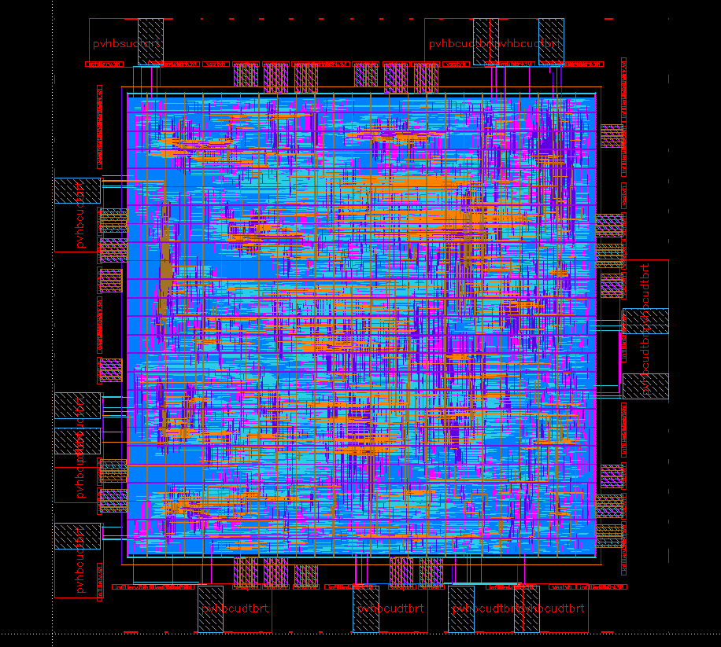

<h1 align="center"> khu_sensor_65n </h1>

khu_sensor is a processor that communicates with MPR121 and ADS1292 and sends filtered **HoD & ECG** data to PC through RS232.  

### khu_sensor GDSII

#### Final Design Specification

|  Spec    |   Value  |
|----------|----------|
| Technology | S65nm |
| Operating Condition | SS 1.08V 125°C (Worst) FF 1.32V -40°C (Best)|
| Main Clock | 111 MHz |
| Slack | 0.2440 ns(Worst) 2.9788 ns(Best) |
| Die Area |  1.4mm x 1.4mm (56 I/O PAD)  |
| Design Area |  1288408 µm^2  |
| Power | 5.9253 mW |

### 01_RTL_Synthesis

###### Compile

###### Re-time

###### Clock-Gating

#### Design Performance

|  Spec (SS 1.08V 125°C)   |   Compile  | Re-time | Clock-Gating |
|----------|------------|--------|-------------|
| Slack (ns) | 0.0 | 0.0  | 4.74  |
| Design Area (µm^2) |  107706.88  | 106533.76 | 100437.12 |
| Power (mw) | 228.0738 | 228.1706 | 5.9253 |

### 03_Physical_Synthesis

#### 00_read_design

#### 01_floorplan

#### 02_powerplan

##### VDD, VSS, VDDT, CLTCH Check

##### FILLTIE Cell (Prevent latchup)

#### 03_place_opt

#### 04_clock_opt_cts

#### 05_clock_opt_post_cts

#### 06_route

#### 07_route_opt

##### Clock Shielding

##### ANTENNA DIODE Cell

##### TIE HIGH Cell

#### 08_chip_finish

##### Layer

##### DECAP Cell

##### FILLER Cell

###### GDSII

